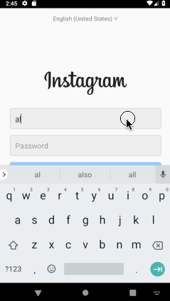

#  *Instakilo*

**Instakilo** is a photo sharing app similar to Instagram but using Parse as its backend.

**You can put this application on your Android device by downloading [this APK file](https://github.com/arl505/Instakilo/blob/master/app-release-unsigned.apk) to your device.**

Onboarding–User registration with email, changing username, splash and welcome screens:

Logon, Home Feed, Profile Screen, Posting:

## Open-source libraries used

- [Android Async HTTP](https://github.com/loopj/android-async-http) - Simple asynchronous HTTP requests with JSON parsing
- [Glide](https://github.com/bumptech/glide) - Image loading and caching library for Android

## License

    Copyright 2018 Alec Levin

    Licensed under the Apache License, Version 2.0 (the "License");
    you may not use this file except in compliance with the License.
    You may obtain a copy of the License at

        http://www.apache.org/licenses/LICENSE-2.0

    Unless required by applicable law or agreed to in writing, software
    distributed under the License is distributed on an "AS IS" BASIS,
    WITHOUT WARRANTIES OR CONDITIONS OF ANY KIND, either express or implied.
    See the License for the specific language governing permissions and
    limitations under the License.
