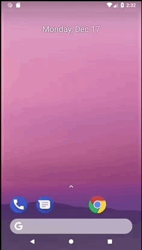

# Lab 5 - SimpleChat
**You can put this application on your Android device by downloading [this APK file](app-release-unsigned.apk) to your device.**

### App Description
**SimpleChat** is a simple Android application for Codepath's week 5 lab that is an exploration into making a simple chat application.

### App Walk-though
 

### User Stories

- [x] All required features implemented
- [x] All bonus features implemented

### License

    Copyright 2018 Alec Levin

    Licensed under the Apache License, Version 2.0 (the "License");
    you may not use this file except in compliance with the License.
    You may obtain a copy of the License at

        http://www.apache.org/licenses/LICENSE-2.0

    Unless required by applicable law or agreed to in writing, software
    distributed under the License is distributed on an "AS IS" BASIS,
    WITHOUT WARRANTIES OR CONDITIONS OF ANY KIND, either express or implied.
    See the License for the specific language governing permissions and
    limitations under the License.
