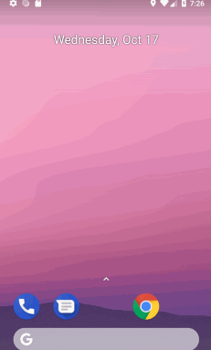
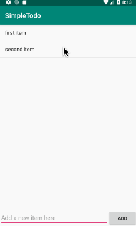

# Pre-work - *SimpleTodo*

**SimpleTodo** is an android app that allows building a todo list and basic todo items management functionality including adding new items, editing and deleting an existing item.

Submitted by: **Alec Levin**

Time spent: **5** hours spent in total

**You can put this application on your Android device by downloading [this APK file](app-release-unsigned.apk) to your device.**

## User Stories

The following **required** functionality is completed:

* [x] User can **successfully add and remove items** from the todo list
* [x] User can **tap a todo item in the list and bring up an edit screen for the todo item** and then have any changes to the text reflected in the todo list.
* [x] User can **persist todo items** and retrieve them properly on app restart

The following **optional** features are implemented:

* [ ] Persist the todo items [into SQLite](http://guides.codepath.com/android/Persisting-Data-to-the-Device#sqlite) instead of a text file
* [ ] Improve style of the todo items in the list [using a custom adapter](http://guides.codepath.com/android/Using-an-ArrayAdapter-with-ListView)
* [ ] Add support for completion due dates for todo items (and display within listview item)
* [ ] Use a [DialogFragment](http://guides.codepath.com/android/Using-DialogFragment) instead of new Activity for editing items
* [ ] Add support for selecting the priority of each todo item (and display in listview item)
* [ ] Tweak the style improving the UI / UX, play with colors, images or backgrounds

[comment]: # (The following **additional** features are implemented:)
[comment]: # (* [ ] List anything else that you can get done to improve the app functionality!)

## Video Walkthrough

Here's a walkthrough of implemented **required** user stories:

Here's a walkthrough of implemented **edit** user story:

GIFs created with [LiceCap](http://www.cockos.com/licecap/).

## Project Analysis

As part of your pre-work submission, please reflect on the app and answer the following questions below:

**Question 1:** "What are your reactions to the Android app development platform so far? Compare and contrast Android's approach to layouts and user interfaces in past platforms you've used."

Having used Visual Studio with Xamarin for Android development in the past and having similar experience using the Eclipse IDE and other full-service development environments, I found using Android Studio to be an enjoyable experience. Android development applications such as Android Studio provide excellent pre-made sandboxes where one can make simple projects to learn the basics without getting weighed down in the nitty gritty of setting up the entire file structure. Furthermore, Android Studio implements the MVC idea through layouts and java that are structured in a way that make sense and is easy to build upon. I’m excited to explore building more complex applications on top of this seemingly simple sandbox.

**Question 2:** "Take a moment to reflect on the `ArrayAdapter` used in your pre-work. How would you describe an adapter in this context and what is its function in Android? Why do you think the adapter is important? Explain the purpose of the `convertView` in the `getView` method of the `ArrayAdapter`."

ArrayAdapter is used to connect each element in a collection of objects to a view. This allows an array to directly be connected to a view containing a list of elements such as ListView. This is important and very helpful because now one only needs to call ‘notifyDataSetChanged’ to update the view and the collection of objects. Since ArrayAdapter populates a list view with each item represented as an individual view, we can optimize the Adapter by only using ‘getView’ as needed and using ‘convertView’ to recycle views. ’convertView’ optimizes the performance of the ‘ArrayAdapter’ by reusing old or unused views.

## Notes

Slightly out of date videos took minor tweaking. Nothing that I couldn't over come, but I foresee students having questions. 

## License

    Copyright [2018] [Alec Levin]

    Licensed under the Apache License, Version 2.0 (the "License");
    you may not use this file except in compliance with the License.
    You may obtain a copy of the License at

        http://www.apache.org/licenses/LICENSE-2.0

    Unless required by applicable law or agreed to in writing, software
    distributed under the License is distributed on an "AS IS" BASIS,
    WITHOUT WARRANTIES OR CONDITIONS OF ANY KIND, either express or implied.
    See the License for the specific language governing permissions and
    limitations under the License.
