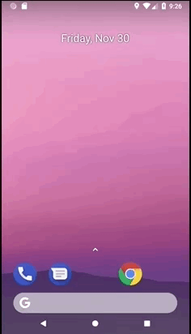
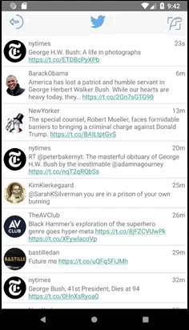

# Project 2 - *Tweeta*

**Tweeta** is an android app that allows a user to view his Twitter timeline. The app utilizes [Twitter REST API](https://dev.twitter.com/rest/public).

**Please Note: As of 01 December 2018 at 00:28, I am attemtpting to implement the incredibly helpful suggestions of [Tejen Patel](https://github.com/tejen) given on [discissions.codepath.com](https://discussions.codepath.com/courses/tech_fellow_training/questions/struggling-to-implement-infinite-pagination-stretch-requirement)** 

**You can put this application on your Android device by downloading [this APK file](app-release-unsigned.apk) to your device.**

Time spent: **5** hours spent in total

## User Stories

The following **required** functionality is completed:

- [x] User can **sign in to Twitter** using OAuth login
- [x]	User can **view tweets from their home timeline**
  - [x] User is displayed the username, name, and body for each tweet
  - [x] User is displayed the [relative timestamp](https://gist.github.com/nesquena/f786232f5ef72f6e10a7) for each tweet "8m", "7h"
- [x] User can refresh tweets timeline by pulling down to refresh

The following **optional** features are implemented:

- [x] User can tap a tweet to display a "detailed" view of that tweet
- [x] User can **click a link within a tweet body** on tweet details view. The click will launch the web browser with relevant page opened.
- [x] User is using **"Twitter branded" colors and styles**

The following **additional** features are implemented:

- [x] User can logout via a logout button and has access to a compose new tweet button

## Video Walkthrough

Here's a walkthrough of implemented user stories:

Sign in, timeline viewing, and clicking a link from timeline:

Refresh (indeterminate progress indicator), detail View, clicking link from detail view, and Logout:

## Notes

Describe any challenges encountered while building the app.

## Open-source libraries used

- [Android Async HTTP](https://github.com/loopj/android-async-http) - Simple asynchronous HTTP requests with JSON parsing
- [Glide](https://github.com/bumptech/glide) - Image loading and caching library for Android

## License

    Copyright 2018 Alec Levin

    Licensed under the Apache License, Version 2.0 (the "License");
    you may not use this file except in compliance with the License.
    You may obtain a copy of the License at

        http://www.apache.org/licenses/LICENSE-2.0

    Unless required by applicable law or agreed to in writing, software
    distributed under the License is distributed on an "AS IS" BASIS,
    WITHOUT WARRANTIES OR CONDITIONS OF ANY KIND, either express or implied.
    See the License for the specific language governing permissions and
    limitations under the License.
