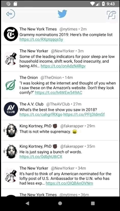
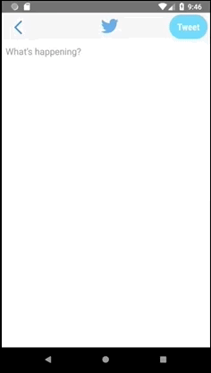
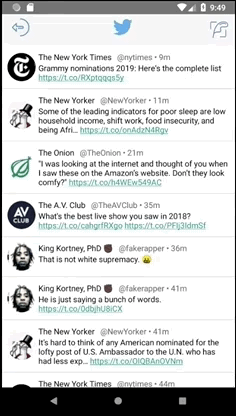

# *Tweeta* 

**Tweeta** is an android app that allows a user to view **their** Twitter timeline. The app utilizes [Twitter REST API](https://dev.twitter.com/rest/public).

**You can put this application on your Android device by downloading [this APK file](https://github.com/arl505/Tweeta/blob/master/app-release-unsigned.apk) to your device.**

## Video Walkthrough

Here's a walkthrough of implemented user stories:

Sign in, timeline viewing, and clicking a link from timeline:

Refresh (indeterminate progress indicator), detail View, clicking link from detail view, and Logout:

Tweet Composing, error checking (whitespace), and counter:

Composing tweet and approaching/hitting limit, sending tweet, timeline loading new tweet:

Pull down to refresh, tweet detail view, click link from detail view, logout:

Click link from timeline, infinite paginitation:

## Open-source libraries used

- [Android Async HTTP](https://github.com/loopj/android-async-http) - Simple asynchronous HTTP requests with JSON parsing
- [Glide](https://github.com/bumptech/glide) - Image loading and caching library for Android

## License

    Copyright 2018 Alec Levin

    Licensed under the Apache License, Version 2.0 (the "License");
    you may not use this file except in compliance with the License.
    You may obtain a copy of the License at

        http://www.apache.org/licenses/LICENSE-2.0

    Unless required by applicable law or agreed to in writing, software
    distributed under the License is distributed on an "AS IS" BASIS,
    WITHOUT WARRANTIES OR CONDITIONS OF ANY KIND, either express or implied.
    See the License for the specific language governing permissions and
    limitations under the License.
