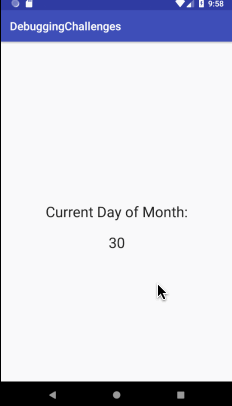

# Lab 3 - Android-debugging-challenges
**You can put this application on your Android device by downloading [this APK file](app-release-unsigned.apk) to your device.**

### App Description
**Android-debugging-challenges** is an android application with five random simple features. This app was created as an exercise in debugging applications with minor errors that cause big problems.

### App Walk-though
 

## Required

- [x] Milestone 1 - What Day Is It
- [x] Milestone 2 - Background Changer
- [x] Milestone 3 - Toolbar!
- [x] Milestone 4 - View movies
